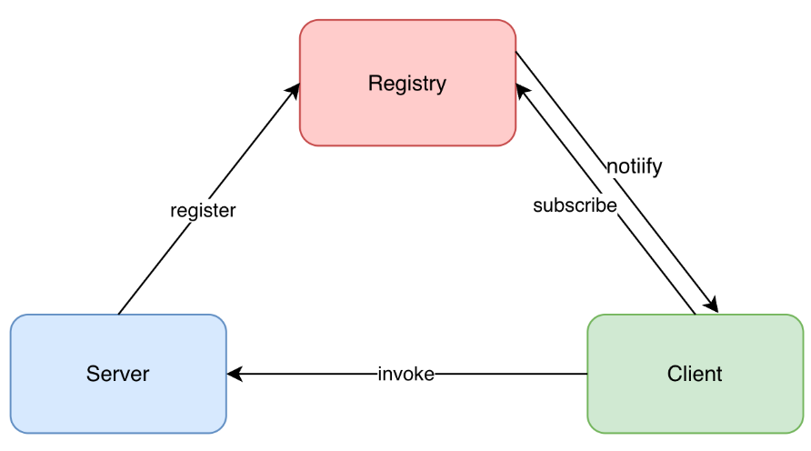

# rpc_framework
使用Java实现一个简易的RPC框架


## 基于原生JDK序列化和动态代理的远程调用

一个完整的RPC框架需要设计到服务注册、负载均衡、序列化等很多东西，但是在最开始，我们先只实现最基本的，那就是客户端和服务器应该如何通信呢？

答案也很简单，服务器监听某个端口，客户端向服务器IP地址上的特定端口发送请求

那么这里又出现了一个问题，那就是请求到来之后，**服务器又是如何得知处理请求的具体方法**是哪个呢？

为了解决这个问题，我们的请求中需要携带`类名 + 方法 + 参数类型 + 具体参数`，如下：

```java
@Data
@AllArgsConstructor
public class RpcRequest implements Serializable{
    String interfaceName;
    String methodName;
    Class<?>[] parameterTypes;
    Object[] parameters;
}
```

有了请求，就势必得有响应数据的格式，响应数据的格式一般固定，`code + message + data`

```java
@AllArgsConstructor
public class RpcResponse<T> implements Serializable {
    private Integer statusCode;
    private String Msg;
    private T Data;
    
    /**
     * 快速响应成功
     */
    public static <T> RPCResponse <T> success(T data) {
        RPCResponse<T> response = new RPCResponse<>();
        response.setStatusCode(ResponseCode.SUCCESS.getCode());
        response.setMsg(ResponseCode.SUCCESS.getMsg());
        response.setData(data);
        return response;
    }
    
    /**
     * 快速响应失败
     * */
    public static <T> RPCResponse <T> fail() {
        RPCResponse<T> response = new RPCResponse<>();
        response.setStatusCode(ResponseCode.FAIL.getCode());
        response.setMsg(ResponseCode.FAIL.getMsg());
        return response;
    }
}
```

注意，因为服务请求需要发送到服务端，数据响应需要发送回客户端，因此我们需要对请求/响应进行序列化和反序列化。


下一个问题，**RPC的目的是让远程调用像本地调用一样，所以无论是客户端还是服务端都需要知道有哪些方法**，不同的是服务端只需要直到有这个方法，同时这个方法能处理什么事情就可以了。而这个方法的具体实现是在服务端完成的。

因此，我们需要一个公共的文件夹来保存这些方法名，所以就有了`rpc-api`这个`module`，其中其实只有一个接口，包含了一个方法

```java
public interface HelloService {
    String hello(HelloObject ho);
}
```

其具体实现在服务端完成


下一个问题，**服务端应该如何处理到来的请求？**

首先是如何取出这个请求，因为我们是通过socket来进行网络通信的

> 这里需要注意：服务器会使用一个ServerSocket来对端口进行监听，当有请求到来时，会通过accept()方法取出这个请求，但是处理这个请求是通过另一个socket来处理的。

因为来到我们服务端的请求反序列化之后就变成了`RpcRequest`格式，所以我们要根据`RpcRequest`中的数据找到相应的方法，这里我们启用线程来进行具体逻辑处理任务。

```java
@SneakyThrows
public Object handle(Object service, RPCRequest request) {
    Method method = service.getClass().getMethod(request.getMethodName(), request.getParameterTypes());
    return method.invoke(service, request.getParameters());
}
```

然后将返回结果转换成`RpcResponse`写入流中，然后传回到客户端


接下来，**客户端应该如何发送请求呢？**

很明显，我们能够想到客户端发送请求其实就是组装出`RpcRequest`，但是客户端只知道有一个接口，而且因为客户端没有该接口的实现类，所以并不能够通过`new`一个实例来通过反射获得相应的信息，那么到底应该如何拿到这些信息呢？

答案是通过动态代理（每一个动态代理类都必须实现`InvocationHandler`这个接口），具体如下

```java
/**
  * 第一个 <T> 表示泛型
  * 第二个 T 表示返回的是T类型的数据
  * 第三个 T 表示的是限制参数类型为 T
  */
@SuppressWarnings("unchecked") // 告诉编译器忽略 unchecked 警告信息，如使用List，ArrayList等未进行参数化产生的警告信息。
public <T> T getProxy(Class<T> clazz) {
    return (T) Proxy.newProxyInstance(clazz.getClassLoader(), new Class<?>[]{clazz}, this);
}
```

通过getProxy得到一个动态代理对象，只要这个对象调用被代理接口中的方法，就会自动执行`invoke()`方法，所以我们需要在重写invoke方法的时候把发送请求的动作添加进去，如下：

```java
@Override
public Object invoke(Object proxy, Method method, Object[] args) throws Throwable {
    RPCRequest rpcRequest = new RPCRequest(method.getDeclaringClass().getName(), method.getName(),
                                           args, method.getParameterTypes());

    log.info("准备发送请求");
    return rpcClient.sendRequest(rpcRequest);
}
```

> [深入理解Java反射+动态代理 - aspirant - 博客园 (cnblogs.com)](https://www.cnblogs.com/aspirant/p/9036805.html)


值得注意的是，在基于Socket的通信需要注意客户端和服务端上输入流和输出流的顺序，下面我们来比对一下

```java
// 客户端发送数据
@Override
@SneakyThrows
public Object sendRequest(RPCRequest rpcRequest) {
    InetSocketAddress address = serviceRegistry.getAddressByServiceName(rpcRequest.getInterfaceName());
    Socket socket = new Socket(address.getHostName(), address.getPort());
    // 必须先getOutputStream，要和服务端相反，避免死锁！！！！
    ObjectOutputStream outputStream = new ObjectOutputStream(socket.getOutputStream());
    ObjectInputStream inputStream = new ObjectInputStream(socket.getInputStream());

    outputStream.writeObject(rpcRequest);
    outputStream.flush();

    return inputStream.readObject();
}

// 服务器接收数据
@Override
@SneakyThrows
public void run() {
    ObjectInputStream inputStream = new ObjectInputStream(socket.getInputStream());
    ObjectOutputStream outputStream = new ObjectOutputStream(socket.getOutputStream());
    RPCRequest request = (RPCRequest) inputStream.readObject();
    log.info("接下来要去调用服务端该方法的实现了...");
    // 根据请求去调用本地的方法
    Method method = service.getClass().getMethod(request.getMethodName(), request.getParameterTypes());
    Object returnData = method.invoke(service, request.getParameters());  // 执行对象的目标方法
    log.info("处理请求成功");

    // 写入输出流
    outputStream.writeObject(RPCResponse.success(returnData));  // 这里要将returnData转成RPCResponse类型
    outputStream.flush();
}
```

总起来说，客户端和服务端输入流和输出流的顺序一定是要反着的，因为如果从流中获取不到数据会一直等待，从而陷入死锁状态


此后，创建测试客户端和测试服务端即可，服务端需要指定监听的端口，客户端需要指定服务器的IP地址和端口。

完成上述工作之后，一个基于原生JDK序列化和动态代理的RPC框架就算是搭建起来了，本部分对应的[commit号84f1245](https://github.com/yangxcc/rpc_framework/commit/84f12457a0e24dfc610b030f4ae7210fd272ac77))


## 加入服务注册功能

上面的工作已经能够实现客户端和服务器之间的通信了，但是理想中的RPC框架还需要一个注册中心



服务端启动时将自己的服务节点信息注册到[注册中心](https://cloud.tencent.com/product/tse?from=10680)，客户端调用远程方法时会订阅注册中心中的可用服务节点信息，拿到可用服务节点之后远程调用方法，当注册中心中的可用服务节点发生变化时会通知客户端，避免客户端继续调用已经失效的节点。

目前有很多成熟的注册中心框架，比如Nacos、Zookeeper，Eureka等，但是在这部分先不用这些框架，而且现在本地创建一个服务注册表，在服务启动的时候将这个表传入

```java
public interface ServiceProvider {
    /**
     * 注册服务
     */
    <T> void addService(T service);

    /**
     * 根据服务名称获取服务实体
     */
    Object getService(String serviceName);
}
```

从上图我们可以看出，注册中心对服务于客户端和服务端的，所以最简单的注册中心也得至少有两个功能，那就是得允许服务器注册服务，还得允许客户端根据服务名称获取到具体的服务实体

因为我们在这部分没有使用框架，所以我的实现方法是先在本地生成一个HashMap，key是服务名称，value是对应的服务实体，具体实现如下

```java
public class ServiceProviderImpl implements ServiceProvider {
    // 在单机模式下无需使用ConcurrentHashMap
    // 服务名称（接口名）对应的服务实体对象
    private static final HashMap<String, Object> serviceMap = new HashMap<>();
    // 已经注册过的类
    private static final HashSet<String> registeredService = new HashSet<>();

    @Override
    public <T> void addService(T service) {
        log.info("启动服务注册");
        // 获取类名 yangxcc.server.serviceImpl.HelloServiceImpl
        String serviceName = service.getClass().getCanonicalName();
        if (registeredService.contains(serviceName)) {
            return;
        }
        registeredService.add(serviceName);
        log.info(serviceName);

        // 获得对象实现的所有接口 [interface yangxcc.rpc.api.service.HelloService]，这样才能够和客户端对应上，因为客户端没有实现类，只能通过动态代理的方式获得接口的对象
        Class<?>[] interfaces = service.getClass().getInterfaces();
        log.info(Arrays.toString(interfaces));

        if (interfaces.length == 0) {
            throw new RPCException(RPCError.SERVICE_NOT_IMPLEMENT_ANY_METHODS);
        }

        for (Class<?> in : interfaces) {
            serviceMap.put(in.getCanonicalName(), service);
        }

        log.info("服务注册完毕");
    }

    @Override
    public Object getService(String serviceName) {
        Object service = serviceMap.get(serviceName);
        if (service == null) {
            throw new RPCException(RPCError.SERVICE_NOT_FOUND);
        }

        return service;
    }
```

从上面的实现中，我们就能够发现一个问题，那就是有一个HashMap和一个HashSet，HashSet的作用就是用来判断服务是否已经注册过了，最开始这里我有这样的疑问，直接通过HashMap.KeySets()不可以吗？实践证明是不行的，因为`service.getClass().getCanonicalName()`得到的是实现类的名字，比如`HelloService service = new HelloServiceImpl()`通过上面方式得到的是的`yangxcc.server.serviceImpl.HelloServiceImpl`，是接口的具体实现类类型，而不是接口类型，那么又有问题了，我们为何不把这个类型名称当作key呢，这显然是不行，因为客户端是没有`HelloService`的实现类的，而是通过动态代理获得的一个对象，最后传入服务器进行查找的还是`yangxcc.rpc.api.service.HelloService`类型，所以得依靠一个HashSet避免服务重复注册


接下来的工作就是修改一下Server的构造方法，把注册表也带进去。


## 使用Netty进行网络传输

使用netty的原因主要是netty使用的是NIO这种IO模型，效率比原始的输入输出流高，因此我们使用Netty来进行网络传输


为了达到这个目的，我们首先把服务端和客户端的方法抽象出来，如下：

```java
// RPCClient
public interface RPCClient {
    Object sendRequest(RPCRequest rpcRequest);
}

// RPCServer
public interface RPCServer {
    void start(int port); // 需要指定监听的端口
}
```

这里作者有一个小改动，那就是在服务注册的时候把`serviceMap`和`registeredService`设置成了static类型了，这样的话，我们在创建`NettyServer`的时候就无需传入`serviceRegister`，因为所有的`ServiceRegister`对象都能够取出相同的`serviceMap`和`registeredService`（static用法），其他对于当前存在的`SocketClient`和`SocketServer`不用做太大的修改    


接下来，我们去实现一下[NettyServer](../rpc-core/src/main/java/yangxcc/netty/server/NettyServer.java)和[NettyClient](../rpc-core/src/main/java/yangxcc/netty/client/NettyClient.java)，在这里面的主要问题是Netty服务启动的时候处理器的顺序

```java
// 客户端
bootstrap.group(group)
    .channel(NioSocketChannel.class)
    .option(ChannelOption.SO_KEEPALIVE, true)
    .handler(new ChannelInitializer<SocketChannel>() {
        @Override
        protected void initChannel(SocketChannel ch) throws Exception {
            ChannelPipeline pipeline = ch.pipeline();
            pipeline.addLast(new CommonDecoder())
                .addLast(new CommonEncoder(new JSONSerializer()))
                .addLast(new NettyClientHandler());
        }
    });

// 服务器
.childHandler(new ChannelInitializer<SocketChannel>() {
    // 责任链模式，编码器，解码器，处理器
    @Override
    protected void initChannel(SocketChannel ch) throws Exception {
        ChannelPipeline pipeline = ch.pipeline();
        pipeline.addLast(new CommonEncoder(new JSONSerializer()));
        pipeline.addLast(new CommonDecoder());
        pipeline.addLast(new NettyServerHandler());
    }
});
```

按照[一文搞懂Netty中Handler的执行顺序_买糖买板栗的博客-CSDN博客_netty handler执行顺序](https://blog.csdn.net/zhengchao1991/article/details/103583766)的说法，存在以下两种情况：

- `ctx.writeAndFlush`只会从当前的handler位置开始，往前找outbound执行
- `ctx.pipeline().writeAndFlush`与`ctx.channel().writeAndFlush`会从tail的位置开始，往前找outbound执行

> Netty中的所有handler都实现自ChannelHandler接口。按照输出输出来分，分为ChannelInboundHandler、ChannelOutboundHandler两大类。ChannelInboundHandler对从客户端发往服务器的报文进行处理，一般用来执行解码、读取客户端数据、进行业务处理等；ChannelOutboundHandler对从服务器发往客户端的报文进行处理，一般用来进行编码、发送报文到客户端。


## 自定义传输协议和JSON序列化器

上面提到了，截止到这部分为止，目前我们采用的编码解码方式都是JDK自带的，这种方式主要存在三个缺点：

1. **无法跨语言**，通过Java的原生`Serializable`接口与`ObjectOutputStream`实现的序列化，只有java语言自己能通过`ObjectInputStream`来解码，其他语言，如`C`、`C++`、`Python`等等，都无法对其实现解码
2. **序列化码流太大，**这种缺点导致的后果就是占用带宽太多，浪费资源，而且很容易造成网络阻塞
3. **序列化时间太慢**


因此，我们在这里自定义序列化器，事实上，序列化器的实现也有相应的框架，比如Kryo、Thrift、Protobuf等

但是在这里我们先借助Jackson工具包手撸一个Json序列化器

首先，为了实现自定义的序列化器，我们首先要明确传输协议的格式，在序列化和反序列化的时候按照这个规则进行解编码

```java
/**
 * +---------------+---------------+-----------------+-------------+
 * |  Magic Number |  Package Type | Serializer Type | Data Length |
 * |    4 bytes    |    4 bytes    |     4 bytes     |   4 bytes   |
 * +---------------+---------------+-----------------+-------------+
 * |                          Data Bytes                           |
 * |                   Length: ${Data Length}                      |
 * +---------------------------------------------------------------+
 */
```


首先，定义出通用序列化器和反序列化器中需要包含的功能，如下：

```java
public class CommonEncoder extends MessageToByteEncoder {
    private static final int MAGIC_NUMBER = 0xCAFEBABE; // 只是用来表明身份的一个数

    public CommonEncoder() {
    }

    /**
     * @param o 需要编码的对象
     * @param bytebuf 字节流管道
     */
    @Override
    protected void encode(ChannelHandlerContext channelHandlerContext, Object o, ByteBuf byteBuf) throws Exception {
        byteBuf.writeInt(MAGIC_NUMBER);
        if (o instanceof RPCRequest) {
            byteBuf.writeInt(REQUEST_PACK.getCode());
        } else {
            byteBuf.writeInt(RESPONSE_PACK.getCode());
        }

        byteBuf.writeInt(serializer.getCode());
        byte[] bytes = serializer.serialize(o);
        byteBuf.writeInt(bytes.length);
        byteBuf.writeBytes(bytes);
    }
}

public class CommonDecoder extends ReplayingDecoder {
    private static final int MAGIC_NUMBER = 0xCAFEBABE; // 只是用来表明身份的一个数

    @Override
    protected void decode(ChannelHandlerContext channelHandlerContext, ByteBuf byteBuf, List<Object> list) throws Exception {
        int magicNumber = byteBuf.readInt();
        if (magicNumber != MAGIC_NUMBER) {
            log.error("这是一个不能够识别的数据包");
            throw new RPCException(RPCError.PACKAGE_NOT_MATCH);
        }

        int packageType = byteBuf.readInt();
        Class<?> clazz;
        if (packageType == PackageType.REQUEST_PACK.getCode()) {
            clazz = RPCRequest.class;
        } else if (packageType == PackageType.RESPONSE_PACK.getCode()) {
            clazz = RPCResponse.class;
        } else {
            log.error("无法判断数据包类型");
            throw new RPCException(RPCError.PACKAGE_TYPE_NOT_FOUND);
        }

        int serializeType = byteBuf.readInt();
        log.info("序列器的序号为{}", serializeType);
        CommonSerializer serializer = CommonSerializer.getSerializerByCode(serializeType);
        if (serializer == null) {
            log.error("未知反序列器");
            throw new RPCException(RPCError.UNKNOWN_DECODER);
        }

        int dataLength = byteBuf.readInt();
        byte[] bytes = new byte[dataLength];
        byteBuf.readBytes(bytes);

        // 解析这个字节流的时候有坑！！
        Object obj = serializer.deserialize(bytes, clazz);
        list.add(obj);
    }
}
```

其实，编码和解码没有什么难的，无非就是按照协议规定的格式将数据转成字节流，然后再将字节流按照规定恢复出来。

**但是在解码的时候有一个坑**

可以看到下面代码在处理`RpcRequest`类型的时候有特殊处理

```java
public Object deserialize(byte[] bytes, Class<?> clazz) {
    try {
        Object obj = objectMapper.readValue(bytes, clazz);
        if (obj instanceof RpcRequest) {
            obj = handleRequest(obj);
        }

        return obj;
    } catch (IOException e) {
        log.error("反序列化时有错误发生：{}", e.getMessage());
        e.printStackTrace();
        return null;
    }
}
```

**这是因为在使用Json编码器进行编码的时候，它是根据字段类型进行反序列化的，而Object对于Json来说是一个很模糊的类型，所以会出现反序列化失败的现象。而RpcRequest中有一个参数`parameterTypes`的类型就是Object类型的，所以需要特殊处理。**

还有一个是在反序列化的时候需要在各个POJO对象中加入一个无参构造器，否则不能反序列化成功

```java
/**
  * 这里使用了json序列化和反序列化Object数组，无法保证反序列化后仍为原类型
  * @param obj
  * @return
  */
@SneakyThrows
private Object handleRequest(Object obj) {
    RPCRequest request = (RPCRequest) obj;
    Class<?>[] parameterTypes = request.getParameterTypes();

    for (int i = 0; i < parameterTypes.length; i++) {
        // 数据类型发生了改变，比如int类型的1变成了“1”
        // 通过保存的参数类型信息来对相应参数进行反序列化
        if (!parameterTypes[i].isAssignableFrom(request.getParameters()[i].getClass())) {
            byte[] bytes = objectMapper.writeValueAsBytes(request.getParameters()[i]);
            request.getParameters()[i] = objectMapper.readValue(bytes, parameterTypes[i]);
        }
    }

    return request;
}
```


## 实现Kryo序列化器

Kryo是专门针对Java对象序列化的框架，虽然也不能够跨语言，但是在其他方面比如性能、序列化结果的体积等方面都表现很好，而且提供了简单易用的SDK，通过下面代码也能够看出来，使用kryo几行代码就完成序列化和反序列化，而且不用考虑Object类型的问题

```java
public class KryoSerializer implements CommonSerializer {

    private static final ThreadLocal<Kryo> kryoThreadLocal = ThreadLocal.withInitial(() -> {
        Kryo kryo = new Kryo();
        kryo.register(RPCResponse.class);
        kryo.register(RPCRequest.class);
        kryo.setReferences(true);
        kryo.setRegistrationRequired(false);
        return kryo;
    });

    @Override
    public byte[] serialize(Object o) {
        ByteArrayOutputStream byteArrayOutputStream = new ByteArrayOutputStream();
        Output output = new Output(byteArrayOutputStream);
        Kryo kryo = kryoThreadLocal.get();
        kryo.writeObject(output, o);
        kryoThreadLocal.remove();

        return output.toBytes();
    }

    @Override
    public Object deserialize(byte[] bytes, Class<?> clazz) {
        ByteArrayInputStream byteArrayInputStream = new ByteArrayInputStream(bytes);
        Input input = new Input(byteArrayInputStream);
        Kryo kryo = kryoThreadLocal.get();
        Object o = kryo.readObject(input, clazz);
        kryoThreadLocal.remove();

        return o;
    }

    @Override
    public int getCode() {
        return SerializeCode.SERIALIZE_BY_KRYO.getCode();
    }
}
```


## 使用Nacos做注册中心

上面我们一直使用的是本地的注册表，这种方法很笨重，而且服务注册和服务器启动高度耦合，所以我们使用Nacos来进行解耦，并且Nacos中有一些特别好的机制，比如保活机制等。

实际上，我们只需要让Nacos做一个注册中心，所以我们可以先想一下我们需要怎么和Nacos交互，即需要哪些方法

```java
// 其实同理，也是需要一个注册方法，和一个通过服务名称得到对应的服务实体
// 这里直接给出Nacos工具类的实现
@Slf4j
public class NacosUtils {
    private static final String nacosAddress = NacosInfo.NACOS_ADDRESS.getHost() + ":" + NacosInfo.NACOS_ADDRESS.getPort();

    private static final NamingService namingService;

    private static final HashSet<String> registeredServices = new HashSet<>();
    private static InetSocketAddress address;

    static {
        namingService = getNamingService();
    }


    // 通过namingService来连接Nacos服务器
    public static NamingService getNamingService() {
        try {
            return NamingFactory.createNamingService(nacosAddress);
        } catch (NacosException e) {
            log.error("连接nacos时有错误发生：{}", e.toString());
            throw new RPCException(RPCError.FAIL_CONNECT_TO_NACOS);
        }
    }

    public static void registerService(String serviceName, InetSocketAddress inetSocketAddress) {
        try {
            log.info(inetSocketAddress.getHostName());
            log.info(String.valueOf(inetSocketAddress.getPort()));
            namingService.registerInstance(serviceName, inetSocketAddress.getHostName(), inetSocketAddress.getPort());
            registeredServices.add(serviceName);
            /**
             * 因为这个address是服务器启动时传过来的，所以他只有一个ip和端口，不会是多个ip和端口
             * 对应到现实场景中，应该是多个接口对应一个实现类，即多个服务对应一个ip+port
             */
            address = inetSocketAddress;
            log.info("服务注册成功:{},{},{}", serviceName, inetSocketAddress.getHostName(), inetSocketAddress.getPort());
        } catch (NacosException e) {
            log.error("向nacos注册服务时有错误发生：{}", e.toString());
            throw new RPCException(RPCError.REGISTER_SERVICE_FAILED);
        }
    }

    public static List<Instance> getAllInstance(String serviceName) throws NacosException {
        return namingService.getAllInstances(serviceName);
    }
}
```


## 实现负载均衡和服务自动注销

可以看到上面的`getAllInstance()`方法，一个服务名称可能对应多个具体的服务对象，应该选择哪一个呢？这里我们提供两种策略，一种是`Random select`，一种是`RoundrRobin select`，随机选择很简单，只需要在这些实例中随便选出一个来，轮询算法也是比较简单，比如第一次访问选择第一个实例，第二次选第二个实例，以此类推...

```java
public interface LoadBalancer {
    /**
     * 选择一个instance
     */
    Instance select(List<Instance> instances);
}
```


实际上，服务自动注销的功能在我看来必要性不是很大，因为开启保活机制之后，一旦服务器掉线，nacos会自动将对应的实例踢出去，实现这个功能的主要目的还是体验一下hook的写法

**所谓hook（钩子），就是在某些事件发生后自动去调用的方法。**

因此我们只需要把注销服务的方法写到关闭系统的钩子方法里就行了。

```java
@Slf4j
public class ShutdownHook {
    private final ExecutorService threadPool = ThreadPoolFactory.createDefaultThreadPool("shutdown-hook");

    /**
     * 使用单例模式创建一个hook对象
     */
    private static final ShutdownHook shutdownHook = new ShutdownHook();

    public static ShutdownHook getShutdownHook() {
        return shutdownHook;
    }

    public void clearAllRegisteredServiceHook() {
        Runtime.getRuntime().addShutdownHook(new Thread(() -> {
            NacosUtils.clearAllRegisteredService();
            threadPool.shutdown();
        }));
    }
}
```

将钩子函数放入服务器启动之后，关闭之前的位置即可


**参考资料**

[为了带你搞懂RPC，我们手写了一个RPC框架 - 腾讯云开发者社区-腾讯云 (tencent.com)](https://cloud.tencent.com/developer/article/1978263)

[Commits · CN-GuoZiyang/My-RPC-Framework (github.com)](https://github.com/CN-GuoZiyang/My-RPC-Framework/commits/master)

[java原生序列化的缺点_文盲青年的博客-CSDN博客_jdk默认序列化存在的问题](https://blog.csdn.net/qq_35890572/article/details/107407948)

[超详细Netty入门，看这篇就够了！-阿里云开发者社区 (aliyun.com)](https://developer.aliyun.com/article/769587)

[Netty 总结篇 - 知乎 (zhihu.com)](https://zhuanlan.zhihu.com/p/95303824)

[序列化 — Kryo序列化 - 怀瑾握瑜XI - 博客园 (cnblogs.com)](https://www.cnblogs.com/lxyit/p/12511645.html#:~:text=一.Kryo介绍. Kryo是一个快速且高效的针对Java对象序列化的框架。. 它的特点：. 序列化的性能非常高. 序列化结果体积较小.,提供了简单易用的API. Kryo序列化被很多开源项目使用，社区非常活跃，版本迭代也比较快。. 以下的重大项目中都在使用Kryo. Apache Hive.)

[万字长文，解密Nacos 为什么这么强！_马小屑的博客-CSDN博客_nacos有什么好](https://blog.csdn.net/weixin_72753070/article/details/125802647?utm_medium=distribute.pc_relevant.none-task-blog-2~default~baidujs_baidulandingword~default-0-125802647-blog-100254996.pc_relevant_default&spm=1001.2101.3001.4242.1&utm_relevant_index=3)
