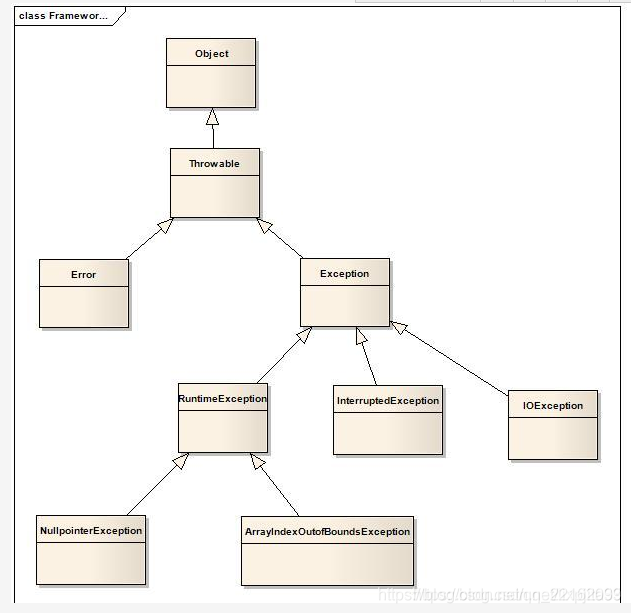

### RPC基础

[有了 HTTP 协议，为什么还要有 RPC ？ | JavaGuide(Java面试+学习指南)](https://javaguide.cn/distributed-system/rpc/http&rpc.html)

总结一下，RPC本质上不能算作一个协议，它是一种调用方式，按照我的理解，目前RPC比HTTP/1.1（目前最普遍）好的地方在于更节省带宽，因为HTTP/1.1中无论是header还是body，基本上都是json格式，前面的字段在很多情况下都是冗余的，而RPC通常不需要有这些字段，因为RPC框架为通信双方规定好了字段，只需要在固定位置填充就好了，此外还有一部分的历史原因...


创建项目，结构如下：

- rpc-api文件夹：服务端与客户端的公共调用接口
- rpc-common文件夹：项目中的一些通用的枚举类和工具类
- rpc-core文件夹：框架的核心实现
- test-client文件夹：测试用的客户端项目
- test-server文件夹：测试用的服务端项目

### Lombok
1. `@Builder`注解，为对象的创建工作提供Builder方法，它提供在设计数据实体时，对外保持**private setter**，而对属性的赋值采用Builder的方式，这种方式最优雅，也更符合封装的原则，**不对外公开属性的写操作！**
                @Builder声明实体，表示可以进行Builder方式初始化。
> Lombok中的@Value注解，表示只公开getter，没有setter方法，所有的成员变量都是final类型，所以它不能和@Builder一起用
> 注意不要和spring中的@Value搞混了

2. `@SneakyThrows`注解，在说明这个注解之前，我们得先来了解一下Java中的异常体系，如下图所示
    

  Throwable是Error和Exception的父类，用来定义所有可以作为异常被抛出的类，Error是编译时错误和系统错误的集合，系统错误一般情况下都不需要我们来关心，基本也不会出现，而编译时错误在写代码的时候编译器会有提醒。我们主要关心的是Exception这个类，**Exception又分为RuntimeException和其他Exception，**前者称为**运行时异常，又称不受检查异常**，意思是代码在编译的时候这种异常情况不会暴露出来，而是在代码实际运行的时候才会出现，比如StackOverflowException、NullPointerException等等；而其他的Exception可以统称为**受检查异常**，这些异常需要开发者解决之后才能够编译通过，解决的方法有两种，包含到`try-catch`语句块中或者throw到上层。

  `@SneakyThrows`的作用就是从代码风格上不用抛出受检查异常，也就是减少了一层层的throw或者很多的`try-catch`代码块，`@SneakyThrows`的原理其实就是将受检查异常强转成RuntimeException，以此来欺骗编译器。

  [SneakyThrows参考链接](https://blog.csdn.net/qq_22162093/article/details/115486647)

3. `AllArgsConstructor`生成全参数构造器，`@NoArgsConstructor`生成无参数构造器
3. `@Slf4j`类中能够直接使用`log.info(), log.error()`等，无需再去创建`logger`对象
3. `@Data`生成`POJO`对象的`Getter, Setter`方法


### 思路

实现一个完整的RPC框架需要涉及到服务注册、负载均衡等比较复杂的场景，在项目初始阶段，我们先忽略这些功能，假设已经知道了客户端和服务器的IP地址和端口，那么我们应该怎么去实现双方通信呢？第一次提交就是完成这个阶段的任务


> 第一步(问题1)：服务端需要哪些信息才能够确定一个唯一需要调用的方法？

需要接口的名字，接口中方法的名字，但由于重载的原因（Java三大特性），我们还需要知道方法中的参数和参数类型

（上述是最基本的请求属性，除此之外，还可以添加一些其他的字段以实现定制化）

因此，我们每一个RPC请求都需要带着这四个参数，见[RPCRequest](../rpc-common/src/main/java/yangxcc/common/RPCRequest.java)，实现了RPCRequest之后，紧接着就能够实现[RPCResponse](../rpc-common/src/main/java/yangxcc/common/RPCResponse.java)（response中通常包含code，message和data，这个code可以使用枚举类实现，见[ResponseCode](../rpc-common/src/main/java/yangxcc/common/enumdata/ResponseCode.java)）

（因为请求需要由客户端发送到服务端，响应也得从服务端返回至客户端，因此我们**需要对请求/响应进行序列化和反序列化**，所以它们都需要实现Serializable（暂时先使用JDK序列化，后面用一些更好的框架））


> 第二步，因为RPC的目的就是让远程调用和本地调用一样，所以我们需要让客户端和服务器都知道有哪些方法

实现了[HelloService接口](../rpc-api/src/main/java/yangxcc/rpc/api/service/HelloService.java)，我们需要在[服务端实现这个接口](../test-server/src/main/java/yangxcc/server/serviceImpl/HelloServiceImpl.java)，客户端不用实现，知道有这个方法就行


> 第三步，服务器应该如何响应请求？

当客户端发送的请求到达，我们首先需要通过socket将请求数据取出来，然后调用接口去处理，为了能够有并发量，我们使用了线程池，见[RPCServer](../rpc-core/src/main/java/yangxcc/server/RPCServer.java)，其中包含了一个`register`方法，所做工作就是将请求数据取出来，然后调用接口去处理，具体的处理线程逻辑见[WorkerThread](../rpc-core/src/main/java/yangxcc/server/WorkerThread.java)

```java
@Override
@SneakyThrows
public void run() {
        ObjectInputStream inputStream = new ObjectInputStream(socket.getInputStream());
        ObjectOutputStream outputStream = new ObjectOutputStream(socket.getOutputStream());
        RPCRequest request = (RPCRequest) inputStream.readObject();
    
        log.info("接下来要去调用服务端该方法的实现了...");
        // 根据请求去调用本地的方法（service就是方法的实现类，通过反射的方式执行对应的方法）
        Method method = service.getClass().getMethod(request.getMethodName(), request.getParameterTypes());
        Object returnData = method.invoke(service, request.getParameters());  // 执行对象的目标方法
        log.info("处理请求成功");
    
        // 写入输出流
        outputStream.writeObject(RPCResponse.success(returnData));
        outputStream.flush();
}
```


> 第四步，客户端应该如何发送请求数据同时处理响应结果？

这里就有一个问题了，客户端这边只知道有一个方法，但并没有该接口的实现类，因此我们需要通过动态代理的方式模拟一个实现类[RPCClientProxy](../rpc-core/src/main/java/yangxcc/client/RPCClientProxy.java)，这里的这个`getProxy()`得到的是`HelloSerivce`的对象，因为使用动态代理方式需要实现`InvocationHandler`类，这个对象的**invoke()方法会在代理对象调用方法时触发**

```java
    /**
     * 第一个 <T> 表示泛型
     * 第二个 T 表示返回的是T类型的数据
     * 第三个 T 表示的是限制参数类型为 T
     * */
    @SuppressWarnings("unchecked") // 告诉编译器忽略 unchecked 警告信息，如使用List，ArrayList等未进行参数化产生的警告信息。
    public <T> T getProxy(Class<T> clazz) {
        return (T) Proxy.newProxyInstance(clazz.getClassLoader(), new Class<?>[]{clazz}, this);
    }


    @Override
    public Object invoke(Object proxy, Method method, Object[] args) throws Throwable {
        RPCRequest rpcRequest = RPCRequest.builder()
                .implementName(method.getDeclaringClass().getName())
                .methodName(method.getName())
                .parameters(args)
                .parameterTypes(method.getParameterTypes())
                .build();

        RPCClient client = new RPCClient();
        log.info("准备发送请求");
        return ( (RPCResponse) client.sendRequest(host, port, rpcRequest)).getData();
    }


    @SneakyThrows  // 异常处理注解，省去对非运行时异常处理的try catch语句
    public Object sendRequest(String host, int port, RPCRequest rpcRequest) {
        Socket socket = new Socket(host, port);
        // 必须先getOutputStream，为什么？
        ObjectOutputStream outputStream = new ObjectOutputStream(socket.getOutputStream());
        ObjectInputStream inputStream = new ObjectInputStream(socket.getInputStream());

        outputStream.writeObject(rpcRequest);
        outputStream.flush();

        return inputStream.readObject();
    }
```


在上面的过程中特别需要注意一个问题，那就是需要注意套接字在客户端和服务器`getInputStream`和`getOutputStream`的顺序，服务端先建立ObjectInputStream后建立ObjectOutputStream，则对应地客户端要先建立ObjectOutputStream后建立ObjectInputStream，否则会造成两方互相等待数据而导致**死锁。**

```java
服务端的输入流中的数据来自客户端的输出流，同理，服务端的输出流到了客户端又成了输入流了
// 服务端
ObjectInputStream inputStream = new ObjectInputStream(socket.getInputStream());
ObjectOutputStream outputStream = new ObjectOutputStream(socket.getOutputStream());

// 客户端
ObjectOutputStream outputStream = new ObjectOutputStream(socket.getOutputStream());
ObjectInputStream inputStream = new ObjectInputStream(socket.getInputStream());
```

[Socket同时使用ObjectInputStream和ObjectOutputStream传输序列化对象时的顺序](https://blog.csdn.net/alrdy/article/details/7718174)
